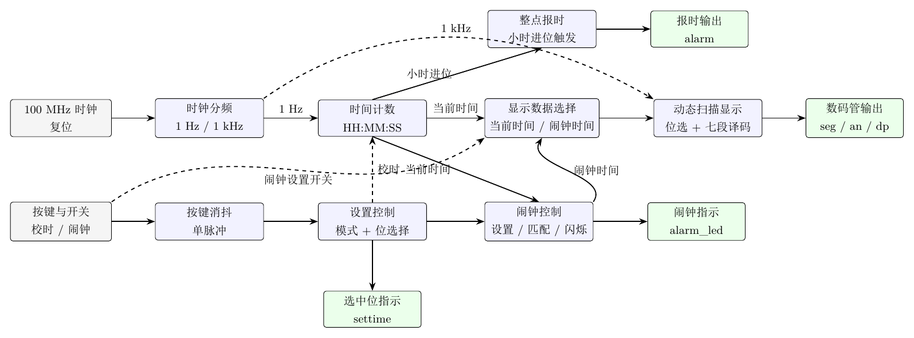

# 大连理工大学计科数电实验三：十进制简易数字钟

> 项目整理时间：2026-05-20  
> 课程实验：大连理工大学计算机科学与技术数字电路实验三  
> 实验主题：十进制简易数字钟

本项目使用 Verilog HDL 在 FPGA 开发板上实现一个 24 小时制十进制数字钟，显示格式为 `HH:MM:SS`。系统基于开发板提供的 100 MHz 时钟完成计时分频、级联计数、数码管动态显示、按键校时、闹钟设置和整点报时等功能。

仓库同时包含实验报告的 LaTeX 源文件、系统结构图、测试照片以及若干关键模块的仿真 testbench，适合作为数字电路实验三的完整记录与开源学习参考。

## 功能概览

- 24 小时制计时：从 `00:00:00` 计数到 `23:59:59` 后回到 `00:00:00`。
- 六位数码管显示：使用动态扫描方式显示小时、分钟、秒。
- 手动校时：通过校时开关进入设置模式，使用左右按键选择位，加减按键修改数值。
- 按键消抖：对机械按键进行同步、消抖和单周期脉冲转换。
- 闹钟设置：进入闹钟设置模式后可修改独立闹钟时间，退出后保存并参与比较。
- 闹钟提示：当前时间与闹钟时间完全匹配后，闹钟 LED 闪烁约 5 秒。
- 整点报时：分钟向小时进位时触发约 1 秒的报时输出。
- 分模块仿真：包含计时、显示、校时消抖和闹钟控制的仿真文件。

## 项目结构

```text
.
├── clock.v                         # Verilog 主源码，包含所有设计模块
├── sim/                            # 仿真 testbench 与仿真波形截图
│   ├── tb_time_counter.v           # 时间计数与 23:59:59 回绕仿真
│   ├── tb_digit_display.v          # 数码管动态扫描仿真
│   ├── tb_set_time_debounce.v      # 校时选择与按键消抖仿真
│   ├── tb_alarm_ctrl.v             # 闹钟设置与触发仿真
│   └── 仿真图片/
├── figures/                        # 报告图片、结构图与开发板测试照片
├── main.tex                        # 实验报告 LaTeX 源文件
├── UCASReport.sty                  # 报告模板样式文件
└── reference.bib                   # 参考文献
```

## 总体框架原理

系统顶层模块为 `clock`，它负责连接各个功能模块，并把内部时间数据送到数码管显示与报警输出端。整体思路是：先将 100 MHz 系统时钟分频成不同用途的低频使能信号，再用这些使能信号驱动计时、扫描和报警逻辑。



核心数据流可以概括为：

```text
100 MHz clk
├── clk_div_1Hz
│   └── tick_1Hz -> time_counter -> 当前时间 HH:MM:SS
├── clk_div_1kHz
│   └── tick_1kHz -> digit_display -> an / seg / colon
├── button_debounce_pulse
│   └── 按键单脉冲 -> set_time -> set_sel / inc_pulse / dec_pulse
├── alarm_ctrl
│   └── 闹钟时间保存、比较与 alarm_led 闪烁
└── hour_chime
    └── 整点进位检测与 alarm 报时输出
```

### 1. 时钟分频

开发板输入时钟为 100 MHz，不能直接用于一秒一次的数字钟计数，也不适合直接控制多位数码管显示。因此设计中包含两个分频模块：

- `clk_div_1Hz`：计满 `100_000_000` 个系统时钟周期后输出一个单周期 `tick_1Hz`，用于驱动秒计数。
- `clk_div_1kHz`：计满 `100_000` 个系统时钟周期后输出一个单周期 `tick_1kHz`，用于数码管动态扫描。

这两个信号本质上都是“使能脉冲”，后级模块仍然统一工作在 100 MHz 主时钟下。

### 2. 时间计数

`time_counter` 使用多个 BCD 计数器级联实现 `HH:MM:SS`：

- 秒个位、分个位使用模 10 计数器。
- 秒十位、分十位使用模 6 计数器。
- 小时部分单独使用 `digit_counter_hour`，限制在 `00` 到 `23` 之间循环。

正常计时时，`tick_1Hz` 先驱动秒个位加一；低位满值回零时产生进位，依次传递到秒十位、分个位、分十位和小时。到达 `23:59:59` 后，下一次 1 Hz 脉冲使系统回到 `00:00:00`。

进入校时模式后，普通 1 Hz 自动计时被屏蔽，当前选中的位只响应加一或减一按键脉冲，避免自动计时和手动修改互相干扰。

### 3. 校时与按键消抖

校时逻辑由 `set_time` 和 `button_debounce_pulse` 共同完成。

`button_debounce_pulse` 先把原始机械按键信号同步到系统时钟域，再等待输入稳定约 20 ms，最后只在稳定按下时输出一个时钟周期的脉冲。这样可以避免一次按键被识别为多次操作。

`set_time` 根据校时开关产生 `set_mode`，并维护 `set_sel`：

```text
set_sel = 0 -> 秒个位
set_sel = 1 -> 秒十位
set_sel = 2 -> 分个位
set_sel = 3 -> 分十位
set_sel = 4 -> 小时个位
set_sel = 5 -> 小时十位
```

左右按键用于循环选择当前位，加减按键用于修改当前位。顶层模块还将 `settime[5:0]` 输出为当前选中位指示信号，可接 LED 辅助观察。

### 4. 数码管动态显示

`digit_display` 负责六位时间数字的动态扫描显示。它在 `tick_1kHz` 控制下让扫描索引 `scan` 在 0 到 5 之间循环，每次只选通一位数码管，并把对应的 BCD 数字送入 `seg_decoder` 转换成七段码。

虽然同一时刻只有一位数码管被点亮，但扫描速度足够快，人眼会看到六位数字同时稳定显示。设计中还使用小数点位置模拟 `HH:MM:SS` 中的冒号分隔。

### 5. 闹钟与整点报时

`alarm_ctrl` 保存一组独立的闹钟时间。打开闹钟设置开关时，显示模块切换为闹钟时间，按键选择和加减逻辑复用校时模块；关闭闹钟设置开关后，闹钟时间被标记为有效，并恢复显示当前时间。

正常计时状态下，闹钟模块持续比较当前时间和闹钟时间。只有在闹钟已经有效、未处于闹钟设置模式、未处于普通校时模式时，六位时间完全相等才会触发闹钟 LED 闪烁。

`hour_chime` 则由小时进位信号触发。当分钟从 `59` 进位到下一小时时，模块输出约 1 秒的 2 kHz 方波，可用于驱动蜂鸣器或 LED。

## 主要模块说明

| 模块 | 作用 |
| --- | --- |
| `clock` | 顶层模块，连接分频、计时、校时、显示、闹钟和报时逻辑。 |
| `clk_div_1Hz` | 从 100 MHz 主时钟产生 1 Hz 计时使能脉冲。 |
| `clk_div_1kHz` | 从 100 MHz 主时钟产生 1 kHz 数码管扫描使能脉冲。 |
| `digit_counter` | 可配置最大值的单个 BCD 位计数器。 |
| `digit_counter_hour` | 24 小时制小时计数与小时校准模块。 |
| `time_counter` | 级联秒、分、小时计数器，产生当前时间和整点进位信号。 |
| `set_time` | 校时模式控制、当前位选择、加减脉冲转发。 |
| `button_debounce_pulse` | 按键同步、消抖和单周期脉冲生成。 |
| `digit_display` | 六位数码管动态扫描显示。 |
| `seg_decoder` | BCD 数字到七段码译码。 |
| `alarm_ctrl` | 闹钟时间设置、保存、比较和 LED 闪烁控制。 |
| `hour_chime` | 整点报时输出控制。 |

## 仿真说明

`sim/` 目录下提供了四个关键 testbench：

- `tb_time_counter.v`：验证秒位进位、校时到 `23:59:58`、以及 `23:59:59 -> 00:00:00` 回绕。
- `tb_digit_display.v`：固定输入 `23:45:06`，观察扫描位序、位选信号和当前显示数字。
- `tb_set_time_debounce.v`：使用较小消抖计数值加快仿真，验证按键抖动只产生一次有效脉冲。
- `tb_alarm_ctrl.v`：验证进入闹钟设置时复制当前时间、退出后保存、匹配后触发 LED。

在 Vivado 中可以将 `clock.v` 添加为设计源文件，将 `sim/*.v` 添加为仿真源文件后分别运行。若使用 Icarus Verilog，可参考下面的命令：

```bash
iverilog -o sim_time_counter.vvp clock.v sim/tb_time_counter.v
vvp sim_time_counter.vvp
```

其他 testbench 只需替换对应的 `tb_*.v` 文件即可。

## 实验报告

实验报告源文件为 `main.tex`，图片资源位于 `figures/`。由于报告包含中文内容，建议使用 XeLaTeX 编译：

```bash
xelatex main.tex
xelatex main.tex
```

## 开发板移植说明

当前仓库主要保存 Verilog 逻辑、报告和仿真文件。若要在自己的 FPGA 开发板上运行，需要根据实际板卡补充或调整约束文件，例如：

- `clk` 绑定到 100 MHz 系统时钟输入。
- `rst`、`set_sw`、`alarm_sw` 绑定到按键或拨码开关。
- `btn_left`、`btn_right`、`btn_inc`、`btn_dec` 绑定到独立按键。
- `seg`、`an`、`colon` 绑定到数码管段选、位选和小数点。
- `alarm`、`alarm_led`、`settime[5:0]` 绑定到 LED 或蜂鸣器相关引脚。

如果开发板主时钟不是 100 MHz，需要同步修改 `clk_div_1Hz`、`clk_div_1kHz`、按键消抖计数和报警持续时间相关计数常数。

## 开源说明

本仓库用于课程实验记录与学习交流。公开到 GitHub 前建议补充合适的 `LICENSE` 文件，并根据需要清理本地编译中间文件。课程实验请独立完成，参考本项目时应理解模块原理后再自行实现。
